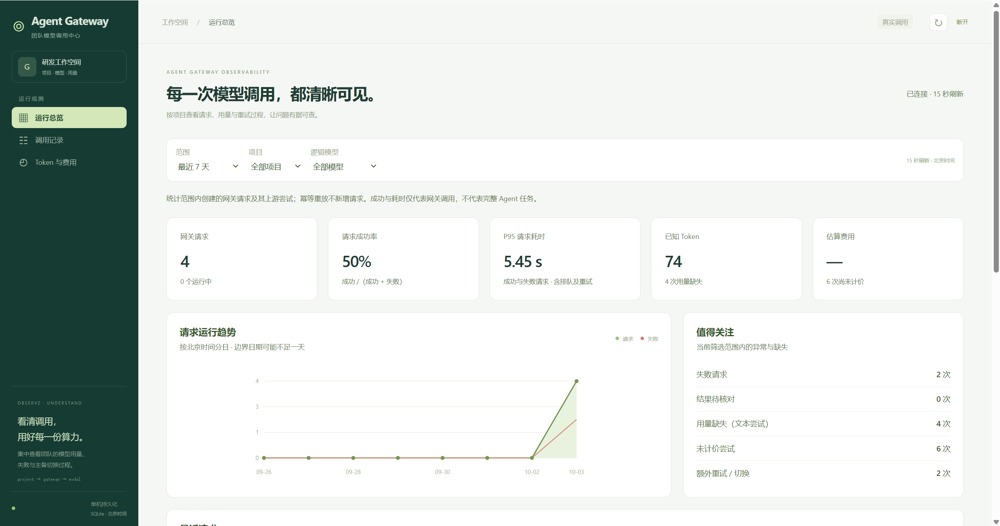
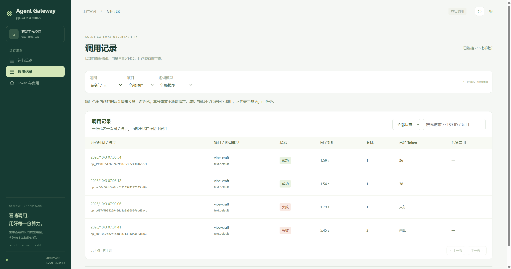
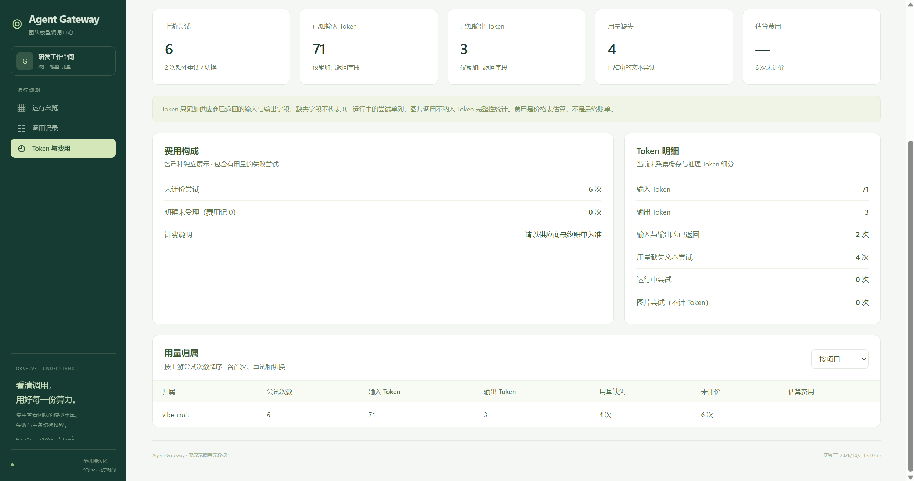

# 小团队 Agent 网关

适用于约 9 人团队的独立模型入口：集中维护 Key，为每个项目分配访问凭据，统一主备切换、超时重试和调用限额。

**本目录独立运行，未接入或修改旁边的图文生成项目。默认是免费演示模式，不读取原项目 `.env`，不调用真实模型。**

管理看板已升级为“运行总览 / 调用记录 / Token 与费用”，支持趋势、筛选分页、重试时间线及项目/模型用量归属。操作方法和统计口径见 [看板使用说明](看板使用说明.md)。

## 看板界面

真实调用模式下的三个页面。截图中的数据来自本机的验证调用，用于展示页面结构和统计口径，不代表业务项目的实际任务量。

**运行总览**：按时间范围、项目、逻辑模型筛选，给出请求数、成功率、P95 耗时、已知 Token 和估算费用，并汇总失败请求、结果待核对、用量缺失、未计价尝试等需要关注的情况。



**调用记录**：一行一次网关请求，展开后可见重试与主备切换的时间线；按任务 ID 搜索能一次找出同一任务的全部调用。



**Token 与费用**：区分已知用量、用量缺失和未计价尝试，按项目与模型归属 Token 和估算费用。供应商没返回用量、或管理员没配置单价时显示“待核对”，不按零计算。



## 1. 启动使用

Windows 双击 **`start.cmd`**，然后打开 <http://127.0.0.1:8020>。

首次启动会创建本目录的虚拟环境、安装依赖，并生成：

- `config.json`：演示主备配置。
- `.env`：随机生成的管理员凭据和演示项目凭据；已忽略 Git。
- `data/gateway.db`：调用记录、操作结果和停用状态。

需要 Python 3.11+。手动启动方式：

```powershell
cd <本目录>
python -m venv .venv
.\.venv\Scripts\python.exe -m pip install -r requirements.lock.txt
.\.venv\Scripts\python.exe setup_gateway.py
.\.venv\Scripts\python.exe run.py
```

在状态页输入**本目录** `.env` 中的 `GATEWAY_ADMIN_KEY`。凭据只保存在页面内存，刷新页面后需重新输入。给业务项目的是它自己的项目 Key，不是管理员 Key。

保持启动窗口运行；关闭窗口或按 Ctrl+C 停止。默认只监听本机 8020，与原图文项目的 8010 分开。不要运行多 worker 或多个进程共用同一数据目录。

## 2. 不花钱跑通一次

在另一个终端执行：

```powershell
.\.venv\Scripts\python.exe smoke.py
```

默认演示模拟“主账户没余额，备用正常”，首次请求会返回 `fallback: true`，回答明确标记为演示数据。状态页能看到主账户停用、备用候选成功和两次上游尝试。后续调用直接使用备用。

演示图片是固定的 **1×1 占位图**，仅用于检查接口与去重，不是模型生成的配图。真实模式不允许混入演示候选。

## 3. 改成真实供应商

先停止网关，再按下面步骤配置：

1. 用 `config.live.example.json` 的内容替换本地 `config.json`；该示例含 `vibe-craft` 项目和 `text.default` / `text.vision` / `image.default` 三个逻辑别名，三个部署的 `model` 都是占位符（`REPLACE_WITH_REAL_TEXT_MODEL_ID`、`REPLACE_WITH_REAL_IMAGE_MODEL_ID`），**必须替换为方舟真实模型 ID**。
2. 在本目录 `.env` 加入 `PROJECT_VIBE_CRAFT_KEY`、`UPSTREAM_PRIMARY_KEY`、`UPSTREAM_BACKUP_KEY`、`UPSTREAM_IMAGE_KEY`。项目 Key 可用 `python manage.py new-key` 生成，与管理员凭据不同。
3. 将各部署的 `model` 填为账户实际开通的模型 ID，核对 `base_url` 和 `capabilities`（图片候选需含 `image`、`image_to_image`、`multiple_reference_images`）。
4. 同一余额账户的多个 Key 使用相同 `account`；共享 RPM/TPM 配额的候选使用相同 `quota_group`。真正独立的备用账户才分别命名。
5. 按供应商官方文档填写 `billing_error_codes`，只有明确的余额/付费额度耗尽错误码才放入。未配置时，一般 429 按临时限流处理，仍可切备用，但不会长期停用账户。
6. 可填写 `input_per_million`、`output_per_million` 和 `currency` 展示估算费用；未填写则显示“待核对”，不会假装费用为零。
7. 重启网关。确认状态页是“真实调用”，再执行一次明确付费的最小测试：

```powershell
.\.venv\Scripts\python.exe smoke.py --live --project project-one
```

真实调用必须自己提供合法可用的账号和 Key。本次交付通过模拟上游验证了故障逻辑，**未使用你的供应商 Key 做付费验证**。

仅支持兼容 Chat Completions 的文本/视觉接口和返回 `b64_json` 的同步图片接口；不宣称支持所有供应商协议。首版不支持 SSE、工具调用、Responses API、JSON Schema 强约束。`json_object` 会检查输出是合法 JSON 对象，具体业务字段仍由业务项目验证。

## 4. 增加一个项目

管理员执行 `python manage.py new-key`，把生成值保存到 `.env`，例如 `PROJECT_RESEARCH_KEY=...`。随后在 `config.json` 的 `projects` 中增加：

```json
"research-agent": {
  "key_env": "PROJECT_RESEARCH_KEY",
  "models": ["text.default"],
  "daily_limit": 200,
  "max_output_tokens": 3500
}
```

重启后，该项目使用网关地址和自己的凭据即可调用。撤销访问时删除对应项目配置，或更换该环境变量的 Key，再重启。

`daily_limit` 是按北京时间统计的**上游尝试次数**，包括首次调用、失败重试和主备切换。它不是费用金额上限；日次数用完后备用账户也不能继续调用。内部演示也计次数。

## 5. 调用接口

所有业务接口都要求 `Authorization: Bearer <项目凭据>`。推荐同时传入 `X-Task-Id` 和 `Idempotency-Key`，方便核对和避免重复提交。

| 接口 | 说明 |
|---|---|
| `GET /health` | 存活、数据库可读和 demo/live 模式；无需 Key |
| `GET /v1/models` | 当前项目可用的逻辑模型名 |
| `POST /v1/chat/completions` | 文本、图片理解、JSON 对象输出 |
| `POST /v1/images/generations` | 独立图片接口；必须提供幂等键 |
| `GET /operations/{id}` | 查询原操作；只能访问自己的项目 |
| `GET /admin/status` | 管理状态；使用独立管理员 Key |
| `POST /admin/reset-block` | 管理员核对账户后解除停用 |

独立 Python 示例，不会自动接入任何现有项目：

```python
import os
import httpx

response = httpx.post(
    "http://127.0.0.1:8020/v1/chat/completions",
    headers={
        "Authorization": "Bearer " + os.environ["MY_PROJECT_KEY"],
        "Idempotency-Key": "task-001:article:v1:g0",
        "X-Task-Id": "task-001",
        "X-Timeout-Ms": "120000",
    },
    json={
        "model": "text.default",
        "messages": [{"role": "user", "content": "请写一句产品介绍"}],
        "max_tokens": 500,
        "stream": False,
    },
    timeout=130,
)
print(response.status_code, response.json())
```

文本允许字段：`model`、`messages`、`max_tokens`、`temperature`、`top_p`、`response_format`、`stream`、`stop`。消息角色支持 `system/user/assistant`。视觉输入使用消息内容中的 `image_url`，其 `url` 必须是 PNG/JPEG/WebP 的 base64 data URL；网关不下载外部图片 URL。

一次请求 JSON 上限 8MB，上游响应上限 32MB。大图请先缩小；模型自身更严格的大小/尺寸约束仍适用。

响应头包含 `X-Gateway-Request-Id`（操作 ID）、`X-Served-Model`、`X-Fallback-Used`、`X-Gateway-Demo`。操作仍在执行时返回 202，按 `poll_url` 查询；同一个幂等键对应不同内容返回 409。成功结果保留 7 天，过期后返回 410，不重新提交上游。

失败响应格式：

```json
{"error":{"code":"PROJECT_DAILY_LIMIT","message":"项目今日调用次数已用完，自动切换不能绕过限额。","retryable":false,"operation_id":"op_..."}}
```

同一次网络重发复用幂等键；修订输入或主动重新生成用新键。不要让业务 SDK 再自动重试；`retryable` 只是提示，网关内部已经执行了有限重试。

## 6. 主备和重试规则

- 文本默认首次调用、重试、切换合计最多 3 次；单次最长 50 秒，总计最长 120 秒，包含排队和退避。
- 请求 `X-Timeout-Ms` 可以缩短总时限，不能超过配置上限。
- 余额明确不足停用整个 `account`；401 停用对应 Key；403 停用对应候选。
- 429 按 `Retry-After` 冷却整个 `quota_group`，可切换独立配额的备用。如果没有立即可用候选，直接返回错误，不长时间占住请求。
- 临时故障连续 3 次暂停候选 60 秒，再允许一次探测。参数错误和内容拒绝不自动重试。
- 模型候选必须具有请求需要的能力：图片理解要求 `vision`，JSON 对象输出要求 `json`。
- 配置和 Key 修改需要重启；停用状态保存在 SQLite，重启不会自动解除“没钱/Key 失效”。

状态页的“验证后恢复”仅清除停用记录，**不会主动付费测试，也不代表已验证成功**。下一次实际请求会重新验证。控制面 Key 不可发给普通项目。

## 7. 图片接口的安全边界

网关已提供独立图片接口，但未接入原图文项目。真实配置示例默认只启用文本；需要图片时，添加 `kind: "image"` 的路由，并配置有 `image` 能力的真实候选，再授权给项目。

图片请求字段：`model`、`prompt`、可选 `image`（1–4 个 data URL）、`size`、`n: 1`、`response_format: "b64_json"`。参考图候选须声明 `image_to_image`，多图须同时声明 `multiple_reference_images`。各供应商扩展参数通过管理员配置中的 `defaults` 设置，例如方舟图片候选可按实际接口要求配置 `watermark`、`sequential_image_generation`。

图片等待时间由路由配置决定，建议 `attempt_timeout: 240`、`deadline: 260`、`max_attempts: 2`。客户端和反向代理的超时设为大于 deadline，例如 270 秒。

只在连接建立前失败、明确鉴权失败或明确余额不足等“未受理”情况下自动换备用。对于图片 429，只有错误码在管理员确认的 `rejected_image_error_codes` 中才视为未受理；其他不确定错误、超时和 5xx 返回 `RESULT_UNKNOWN`，不自动重发。

本版没有供应商任务查询适配器。未知结果需要管理员在供应商后台核对，同幂等键仍返回待核对；确认要重新生成后使用新幂等键。未知记录持续保留，不会定时自动重跑或自动认定免费。

## 8. 运维与备份

- 默认并发：文本 5、生图 2；按上游配额调整配置。文本排队最多 2 秒、生图最多 5 秒，满了返回 `GATEWAY_BUSY`。
- 每天自动在线备份 SQLite 到 `data/backups/`，保留最近 7 份。另把备份复制到独立磁盘；同盘备份不能应对磁盘损坏。
- 手动备份：`python manage.py backup backups/gateway-manual.db`，目标必须是新文件。
- 恢复：先停止网关，保存当前 `data` 目录，再将备份放入一个新的数据目录并命名为 `gateway.db`；使用恢复后的目录替换原 `data`。不要把新数据库与旧 WAL/SHM 文件混在一起。
- 凭据在 `.env`，数据库备份不包含它；由管理员另行安全保存。备份数据库包含用于查询/去重的模型结果，同样限制访问权限。
- 调用元数据通常保留 30 天，成功结果内容保留 7 天。未核对操作与未知费用继续保留；幂等标识保留以阻止旧操作重新提交。结果内容是业务恢复数据，不出现在状态页或普通日志。
- 服务异常重启后，未完成操作会标记待核对，不自动重放付费请求。
- 当前是单机服务，机器停机时所有接入项目暂不可用。先使用常开机器；需要自动开机运行时可由管理员配置 Windows 任务计划程序。
- 跨机器共享时通过可信内网/VPN + HTTPS 反向代理访问，项目凭据不要通过公网明文 HTTP 传输。反向代理不要重试 POST，读超时应大于路由 deadline。

## 9. 开发与验证

```powershell
.\.venv\Scripts\python.exe -m pip install -r requirements-dev.txt
.\.venv\Scripts\python.exe -m pytest
node --check web/app.js
```

测试使用模拟 HTTP 上游，不消耗模型费用，覆盖：账户/Key 隔离、全局尝试数、总时限、共享配额、并发日上限、请求去重、项目隔离、图片未知结果、重启恢复和管理员权限。

```text
agent-gateway/
  gateway/          配置、API、路由执行和 SQLite 存储
  web/              运行总览、调用记录、Token 与费用看板
  tests/            故障注入与并发验证
  config*.json      演示 / 真实配置模板；本地 config.json 不入库
  setup_gateway.py  生成独立配置和随机访问凭据
  run.py            单进程启动
  smoke.py          最小调用测试；真实调用须显式 --live
  manage.py         新 Key 生成与在线备份
  start.cmd         Windows 启动入口
```

技术实现参考：[HTTPX 超时配置](https://www.python-httpx.org/advanced/timeouts/)、[FastAPI 生命周期](https://fastapi.tiangolo.com/advanced/events/)。
